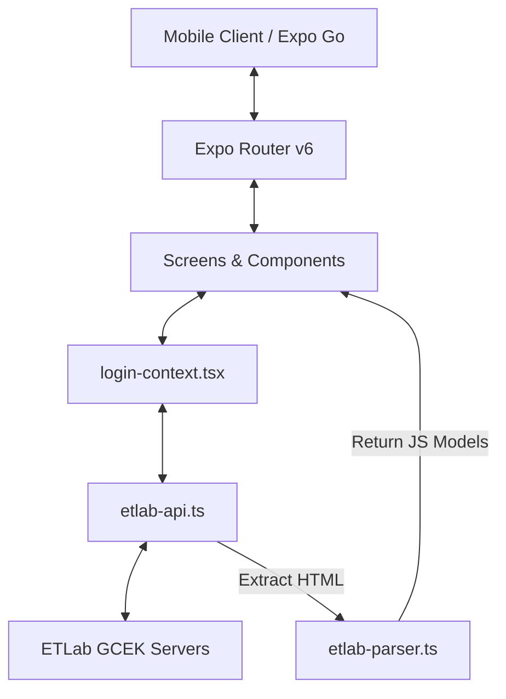

# 🏛️ My GCEK — The Digital Curator

A premium, state-of-the-art React Native mobile portal built for the students of **Government College of Engineering, Kannur** (GCEK). This application interfaces securely with the official college ETLAB system to deliver a real-time, offline-first dashboard for academic records, attendance forecasting, coursework, and faculty surveys.

---

## 🌟 Key Features

* **📅 Smart Attendance Forecaster:** Displays live subject-wise attendance percentages with a customizable target threshold selector ($75\%$ to $95\%$). Includes period-by-period attendance logs and dynamic predictive safety banners showing exactly how many hours a student can safely miss or must consecutively attend to remain safe.
* **⭐ Comprehensive Academic Ledger:** A compact, sentence-cased collapsible details interface for tracking university results, sessional exams, internal grades, and assignments, backed by performance-coordinated colored indicators (green, amber, or red status borders) and automatic sessional name fallbacks.
* **📝 Coursework & Surveys:** Swaps card hierarchy to prioritize Course Name as the bold header, displaying neutral course code badges, dynamic relative urgency labels (`"Due tomorrow"`, `"Due today!"`, `"Overdue by X days"`), interactive Reanimated shadow-glow press highlights, and deep-linked browser redirections for surveys.
* **🎨 Premium Glassmorphic Navigation:** A floating animated navigation bar styled with a translucent `BlurView` backplate, responsive window-width offsets, selection haptic feedback, and a centering translation transform.
* **🔒 Secure Auto-Reauthentication:** Bypasses short ETLAB session expiration limits by securely storing credentials inside the device's hardware-isolated secure enclave (`SecureStore` Keychain on iOS / Keystore on Android). Performs transparent, silent background re-logins when session cookies expire.
* **💾 TTL & SWR Local Caching:** Fast, offline-first page loads via Stale-While-Revalidate (SWR) fetching and time-to-live (TTL) cache invalidation.

---

## ⚙️ Tech Stack & Architecture



* **Core Framework:** React Native with Expo SDK 54 & Expo Router.
* **Language:** TypeScript.
* **Data Processing:** Robust Cheerio-based HTML parsing engine capable of scraping GCEK vertical layouts and custom horizontal attendance grids.
* **Storage & Encryption:** Hardware-backed credential encryption via `expo-secure-store` and cached data persistence via `react-native-async-storage`.

---

## 🛠️ Technical Deep Dive

### 1. Secure Auto-Reauthentication
To bypass short ETLab session timeouts (which frequently sign users out), the portal implements a silent re-authentication layer:
* **Storage:** Credentials are saved in the device's hardware-backed secure enclave (`SecureStore`) only when `"Keep me logged in"` is checked.
* **Silent Login:** During app mount or when a network request detects a session-expired redirect, the app automatically attempts a silent background re-login using the stored credentials to restore the session cookie transparently.
* **Privacy:** Passwords are used strictly to establish an encrypted HTTPS network session with the official GCEK servers and are never transmitted to any third-party endpoints.

### 2. Double-Encrypted Local Cache
The app implements a custom security layer for offline storage to prevent local data snooping on rooted/compromised devices:
* **XXTEA Block Cipher:** All cached screens (attendance, results, assignments, timetable) are encrypted using the XXTEA block cipher before writing to `AsyncStorage`.
* **Keychain-Backed Key:** The 32-character symmetric key is generated dynamically on first boot and stored in `SecureStore`. The cached payloads cannot be decrypted without active Keychain/Keystore access.

### 3. Attendance Forecasting Mathematics
The dashboard predicts exactly how many classes a student can afford to miss or needs to attend. Let $A$ represent attended classes, $T$ represent total classes, and $F$ represent the target threshold fraction (e.g. $0.75$ for $75\%$):

* **Safe Margin (Allowed to Miss):** If the current percentage is $\ge$ target:
  $$\text{Max Missable Classes} = \left\lfloor \frac{A}{F} - T \right\rfloor$$
* **Recovery (Required Consecutive Attendance):** If the current percentage is $<$ target:
  $$\text{Required Classes} = \left\lceil \frac{F \times T - A}{1 - F} \right\rceil$$

### 4. DOM Parsing Engine
Rather than using fragile and insecure RegExp matches, the app processes raw GCEK server responses using `cheerio/slim`:
* Decodes HTML entities robustly.
* Normalizes non-standard horizontal rows (e.g., student roster layout grids) into a standardized JavaScript object array.
* Dynamically maps shorthand course codes (e.g., `CST302`) to full friendly subject names (e.g., `Compiler Design`) using the results schema history.

---

## 🚀 Getting Started

### Prerequisites

Ensure you have [Node.js](https://nodejs.org/) installed, and a package manager (`npm` or [pnpm](https://pnpm.io/)) configured:
```bash
npm install -g pnpm
```

### Installation

1. Clone the repository and navigate to the project root:
   ```bash
   cd my-gcek
   ```
2. Install dependencies:
   ```bash
   pnpm install
   ```

### Running Locally

To run the Metro development server, use the following commands:

* **Simulators / Local Network (LAN):**
   ```bash
   pnpm start
   ```
* **Bypassing Network Firewalls / Custom Wi-Fi (Tunnel Mode):**
   ```bash
   pnpm start --tunnel
   ```

Once started, scan the QR code using your phone's camera (iOS) or the **Expo Go** application (Android) to load the application.

---

## 📂 Project Structure

```text
├── assets/             # Image resources, app launcher icons, and branding logo
├── src/
│   ├── app/            # App routes (tab layouts & page view screens)
│   │   ├── _layout.tsx # Main navigation provider
│   │   ├── index.tsx   # Entry gatekeeper logic (auth guard router)
│   │   └── ...         # Result, assignment, survey screens
│   ├── components/     # Reusable UI views (cards, tab bars, context providers)
│   ├── constants/      # Centralized theme colors, typography, and spacing metrics
│   ├── hooks/          # Custom state hooks
│   └── services/       # Network API endpoints, HTML parser, and cache manager
├── app.json            # Expo configuration file
├── package.json        # NPM dependencies and scripts
└── tsconfig.json       # TypeScript configuration details
```

---

> [!NOTE]  
> All data displayed in this application is fetched live from the official GCEK ETLAB website. The app parses and processes data directly on your device, ensuring maximum speed, responsiveness, and user privacy.
