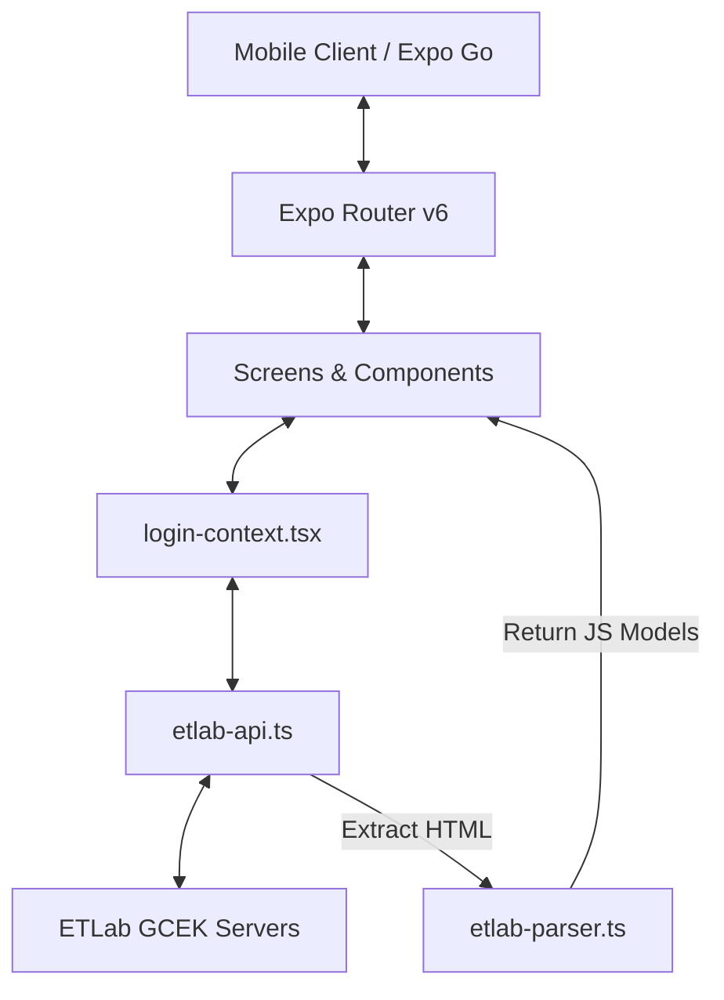

# 🏛️ ETLab GCEK — The Digital Curator

A premium, state-of-the-art React Native mobile portal built for the students of **Government College of Engineering, Kannur**. This application interfaces securely with the official college ETLAB system to deliver a real-time, offline-first dashboard for academic records, attendance forecasting, assignments, and surveys.

---

## 🌟 Key Features

* **📅 Smart Attendance Forecaster:** Displays live subject-wise attendance percentages. It includes dynamic predictive banners showing exactly how many classes a student can safely miss, or how many consecutive hours they need to attend to cross the critical $75\%$ threshold.
* **⭐ Comprehensive Academic Ledger:** A collapsible, organized interface for tracking sessional test marks, assignments, seminars, tutorials, and sessional internal grades.
* **📝 Coursework & Surveys:** Aggregates pending coursework details and lists active faculty surveys with deep-links for immediate browser redirection.
* **🎨 Premium Aesthetics:** Full support for system-wide light/dark themes, clean card layouts, subtle shadows, and custom-tailored HSL colors.
* **🔒 Privacy-Preserving Security:** Transient password handling—passwords are used strictly to establish an encrypted network session and are **never** written to local memory or disk.

---

## ⚙️ Tech Stack & Architecture



* **Core Framework:** React Native with Expo SDK 54 & Expo Router.
* **Language:** TypeScript.
* **Data Processing:** High-performance, zero-dependency RegExp-based HTML parsing engine capable of handling standard vertical layouts and custom GCEK horizontal grid layouts.
* **Storage:** Encrypted local persistence using `expo-secure-store`.

---

## 🚀 Getting Started

### Prerequisites

Ensure you have [Node.js](https://nodejs.org/) installed, and [pnpm](https://pnpm.io/) configured:
```bash
npm install -g pnpm
```

### Installation

1. Clone the repository and navigate to the project root:
   ```bash
   cd MyGcek
   ```
2. Install dependencies:
   ```bash
   pnpm install
   ```

### Running Locally

To run the development server, use the following commands depending on your environment:

* **Simulators / Same Network (LAN):**
  ```bash
  pnpm start
  ```
* **Bypassing Network Firewalls / Custom Wi-Fi (Tunnel Mode):**
  ```bash
  pnpm start --tunnel
  ```

Once started, scan the QR code using your phone's camera (iOS) or the **Expo Go** application (Android) to load the application.

---

## 📂 Project Structure

```text
├── assets/             # Image resources and app launcher icons
├── screens/            # Raw HTML and designs for reference
├── src/
│   ├── app/            # App routes (navigation layouts & tabs)
│   │   ├── _layout.tsx # Main navigation provider
│   │   ├── index.tsx   # Entry logic (isLoggedIn router)
│   │   └── ...         # Subpages (result, assignment, survey)
│   ├── components/     # Reusable UI views (cards, tab bars, context providers)
│   ├── constants/      # App theme colors, typography, styles
│   └── services/       # Network API fetching and parsing engines
├── app.json            # Expo configuration file
└── package.json        # NPM dependencies and scripts
```

---

> [!NOTE]  
> All data displayed in this application is fetched live from the official GCEK ETLAB website. The app processes data directly on your device, ensuring maximum speed, responsiveness, and privacy.
